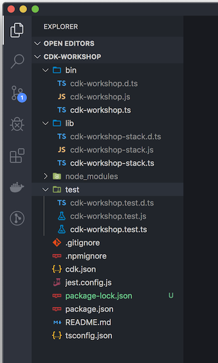

+++
title = "First steps"
weight = 100
+++

# Starting a project

We must first create a project using `cdk init`. This will set up the scaffolding for our project. 


First, create an empty directory and move into it in the shell:

```
mkdir cdk-workshop && cd cdk-workshop
```

Now, use `cdk init` to create a new CDK project. 



```
cdk init sample-app --language typescript
```



```
cdk init sample-app --language python
```

A Python virtual environment will be created at `.venv`. Should you need to recreate it,
remove the `.venv` directory and issue the following commands in the same directory as your cdk project:

```
python3 -m venv .venv
source .venv/bin/activate
$ pip install -r requirements.txt
```

If you are on Windows, use the following instead of `source`:

```
% .venv\Scripts\activate.bat
```



```
cdk init sample-app --language csharp
```



```
cdk init sample-app --language java
```






# The structure of a CDK project


Now's a good time to open the project in your favorite IDE and explore.


The CDK workshop highly suggests an IDE that supports code completion. With limited exception,
the calls in Javascript/Typescript will be nearly identical to the calls in other languages. 

There are some languages which are unique: Python users will find their calls translated into `snake_case` while Go users will find that many values (especially those which are optional)
are pointers to a structure. This workshop expects you are reasonably familiar with the language
you are working in. 

If you get stuck, you can [see the completed workshop stacks](https://github.com/aws-samples/aws-cdk-intro-workshop/tree/master/code/) on GitHub.




## Explore your project directory

You'll see something like this:



Two core sections are important: the Stack and the App.

* The Stack is where your CDK application's main stack is defined. Stacks are (semi-)independent collections of resources; think of them as services. A stack can depend on resources from another stack, but won't have full ownership over them. In most languages, this is a library or module, such as `lib/cdk-workshop-stack.ts` or `cdk-workshop/cdk-workshop_stack.py`.

* The CDK "App": `bin/cdk-workshop.ts`, `app.py`, etc -- this is the entrypoint of the CDK application. It will load and configure the stack(s) for your project.

Regardless of which language you're using, there's some files that will stick around:

* `cdk.json` tells the toolkit how to run your app.
* `.gitignore` and `.npmignore` tell git and npm which files to include/exclude
  from source control and when publishing this module to the package manager.


You'll also find that there's some language-specific tracking files (such as `requirements.txt`, `go.mod`) depending on the language you've chosen to work with. 

## Your app's entry point

Let's have a quick look at the CDK "App" itself. For this, we're going to use the Typescript version, but you should be able to follow along no matter what.

```js
#!/usr/bin/env node
import * as cdk from 'aws-cdk-lib';
import { CdkWorkshopStack } from '../lib/cdk-workshop-stack';

const app = new cdk.App();
new CdkWorkshopStack(app, 'CdkWorkshopStack');
```

All this does is load and configure the CDK App and our Workshop Stack. We won't need to touch this much.

For most languages, you'll see a call to `app.synth()` -- This is important. This tells the CDK application that it should "synthesize" the application at this point. 

## The main stack

Open up `lib/cdk-workshop-stack.ts`. This is where the meat of our application
is:

```ts
import * as cdk from 'aws-cdk-lib';
import * as sns from 'aws-cdk-lib/aws-sns';
import * as subs from 'aws-cdk-lib/aws-sns-subscriptions';
import * as sqs from 'aws-cdk-lib/aws-sqs';

export class CdkWorkshopStack extends cdk.Stack {
  constructor(scope: cdk.App, id: string, props?: cdk.StackProps) {
    super(scope, id, props);

    const queue = new sqs.Queue(this, 'CdkWorkshopQueue', {
      visibilityTimeout: cdk.Duration.seconds(300)
    });

    const topic = new sns.Topic(this, 'CdkWorkshopTopic');

    topic.addSubscription(new subs.SqsSubscription(queue));
  }
}
```

As you can see, our app was created with a sample CDK stack
(`CdkWorkshopStack`).

The stack includes:

- SQS Queue (`new sqs.Queue`)
- SNS Topic (`new sns.Topic`)
- Subscribes the queue to receive any messages published to the topic (`topic.addSubscription`)


# See Also

- [AWS CDK Command Line Toolkit (cdk) in the AWS CDK User Guide](https://docs.aws.amazon.com/CDK/latest/userguide/tools.html)
